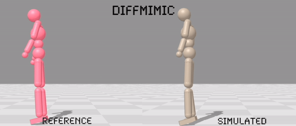

<div align="center">

<h1>DiffMimic: <br> Efficient Motion Mimicking with Differentiable Physics</h1>

<div>
Jiawei Ren<sup>*</sup>&emsp;Cunjun Yu<sup>*</sup>&emsp;Siwei Chen&emsp;Xiao Ma&emsp;Liang Pan</a>&emsp;Ziwei Liu<sup>&dagger;</sup>
</div>
<div>
    S-Lab, Nanyang Technological University&emsp; 
    National University of Singapore &emsp;<br>
    <sup>*</sup>equal contribution <br>
    <sup>&dagger;</sup>corresponding author 
</div>

<div>
   <strong>ICLR 2023</strong>
</div>
<div>

</div>

---

<h4 align="center">
  <a href="https://diffmimic.github.io/" target='_blank'>[Project Page]</a> •
  <a href="https://openreview.net/forum?id=06mk-epSwZ" target='_blank'>[Paper]</a> •
<a href="https://diffmimic-demo-main-g7h0i8.streamlit.app/" target='_blank'>[Demo]</a> •
<a href="https://youtu.be/B0unbsvGsLc" target='_blank'>[Video]</a> 

</h4>

</div>

## About
We implement DiffMimic with [Brax](https://github.com/google/brax): 
>
>
>Brax is a fast and fully differentiable physics engine used for research and development of robotics, human perception, materials science, reinforcement learning, and other simulation-heavy applications.

An environment `mimic_env` is implemented for training and benchmarking. `mimic_env` now includes the following characters:
- [HUMANOID](diffmimic/mimic_envs/system_configs/HUMANOID.py): [AMP](https://github.com/nv-tlabs/ASE/blob/main/ase/data/assets/mjcf/amp_humanoid.xml)-formatted humanoid, used for acrobatics skills.
- [SMPL](diffmimic/mimic_envs/system_configs/SMPL.py): [SMPL](https://smpl.is.tue.mpg.de/)-formatted humanoid, used for mocap data.
- [SWORDSHIELD](diffmimic/mimic_envs/system_configs/SWORDSHIELD.py): [ASE](https://github.com/nv-tlabs/ASE/blob/main/ase/data/assets/mjcf/amp_humanoid_sword_shield.xml)-formatted humanoid, used for REALLUSION sword-shield motion.

More characters are on the way.


## Installation
```
conda create -n diffmimic python==3.9 -y
conda activate diffmimic

pip install --upgrade pip
pip install --upgrade "jax[cuda]==0.4.2" -f https://storage.googleapis.com/jax-releases/jax_cuda_releases.html
pip install -r requirements.txt
```

## Get Started
```shell
python mimic.py --config configs/AMP/backflip.yaml
```

## Visualize
```shell
streamlit run visualize.py
```


## Citation
If you find our work useful for your research, please consider citing the paper:
```
@inproceedings{ren2023diffmimic,
  author    = {Ren, Jiawei and Yu, Cunjun and Chen, Siwei and Ma, Xiao and Pan, Liang and Liu, Ziwei},
  title     = {DiffMimic: Efficient Motion Mimicking with Differentiable Physics},
  journal   = {ICLR},
  year      = {2023},
}
```
## Acknowledgment
- Differentiable physics simulation is done by [Brax](https://github.com/google/brax).
- Early version of the code is heavily based on [Imitation Learning via Differentiable Physics (ILD)](https://github.com/sail-sg/ILD).   
- Motion files are borrowed from [DeepMimic](https://github.com/xbpeng/DeepMimic), [ASE](https://github.com/nv-tlabs/ASE), [AMASS](https://amass.is.tue.mpg.de/), and [AIST++](https://google.github.io/aistplusplus_dataset/factsfigures.html).
- Characters are borrowed from [DeepMimic](https://github.com/xbpeng/DeepMimic) and [ASE](https://github.com/nv-tlabs/ASE).
- The work is inspired by valuable insights from [SuperTrack](https://montreal.ubisoft.com/en/supertrack-motion-tracking-for-physically-simulated-characters-using-supervised-learning/) and [Spacetime Bound](https://milkpku.github.io/project/spacetime.html).